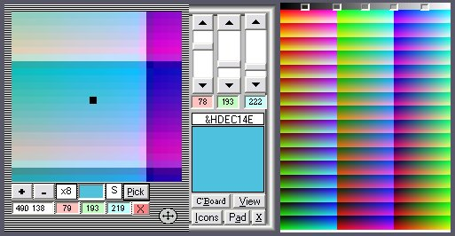



## Desktop magnifier and Screen color picker \(More additions 16 Apr\)

### Description

Desktop Magnifier &amp; Screen Color Picker by Robert Rayment: (Update7 16 Apr))(Added simple RGB color maker, saving Hex color to Clipboard and selectable from a button on the magnifier). Always on top, x2, x4,,,x32 magnification, RGB to Clipboard, exact location of cursor shown on magnifier with a black dot. Magnifier can be moved to any part of the screen. Keys: S to save RGB to clipboard. Incorporated code by LaVolpe to see layered windows!

----

Update: Moved all controls onto picture box &amp; made the form same size as picture box. Accomodate the 120 dpi as well as the normal 96 dpi.

----

Update2: All on one Form. With Color Maker, added click on screen to set Scrollbars. Mag +- button 2,4,8,16,32. Move one pixel with arrow keys. Esc also to Exit. Toggle Color Maker. Added Matthew's border UC(CodeId 64572).

----

Update3: All suggestions included, in particular black dot can be toggled black/white so visible on any background. Zip 19 KB.

----

Update4: Simplified. Tidy up exitting. Zip 11 KB.

----

Update5: Added Hide Icons from Augustin Rodriguez's 'Virtual Aquarium' CodeId=64997).

----

Update6: Adjusted RGB picker for 120 DPI. Anyone know a general routine for this?

----

Update7: Added Color pad (5 x 47773 colors) &amp; Clipboard View. Zip 21 KB.
 
### More Info
 
Just Run

RGB

             |
---                |---
**Submitted On**   |2006-04-16 07:30:02
**By**             |[Robert Rayment](https://github.com/Planet-Source-Code/PSCIndex/blob/master/ByAuthor/robert-rayment.md)
**Level**          |Intermediate
**User Rating**    |5.0 (65 globes from 13 users)
**Compatibility**  |VB 6\.0
**Category**       |[Graphics](https://github.com/Planet-Source-Code/PSCIndex/blob/master/ByCategory/graphics__1-46.md)
**World**          |[Visual Basic](https://github.com/Planet-Source-Code/PSCIndex/blob/master/ByWorld/visual-basic.md)
**Archive File**   |[Desktop\_ma1987474162006\.zip](https://github.com/Planet-Source-Code/robert-rayment-desktop-magnifier-and-screen-color-picker-more-additions-16-apr__1-64523/archive/master.zip)

### API Declarations

A few, see code

